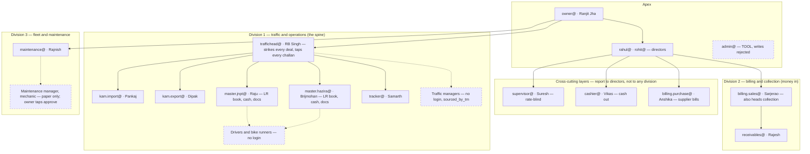
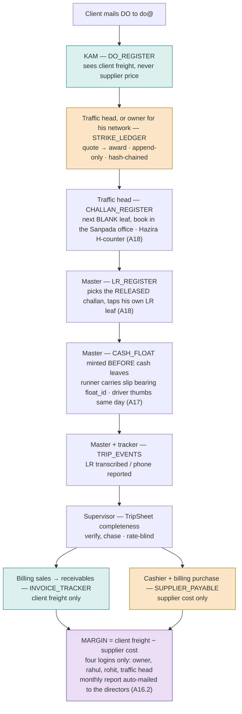

# ORG_STRUCTURE.md — RSJ Carriers: who sits where, who hands what to whom
**Status: APPROVED as Amendment A16 (2026-09-11); amended by A17, A18, A19, A20, A21, A22 (2026-09-12) and A23 (2026-09-13, Traffic Manager list). Phase 2 gate tests are G1–G45 and live in `PHASE2_GATES.md` — §6 of this file is a pointer. §10 holds the diagrams; §11 is the amendment trail. This is the consolidated handover copy Claude Code found missing from the repo on 2026-09-13; commit it at the repo root.**

This file reconciles the owner's two hand-drawn hierarchy sheets (RSJ_HIERARCHY-1/2, September 2026) with the locked seat roster (A8/A9) and the locked mechanics (A2, A6, A13, D8, D18, D19). Where the drawing and an amendment disagree, the amendment wins and the reason is stated. The older `rsj_pipeline_refined.png` is **retired** — it names roles that do not exist in the roster (EWB & Document Clerk, Collection Head as a separate seat, Own/Supplier Vehicle Traffic Manager, Field Executives with a box of their own) and must not be used as a reference again.

---

## 1. Rulings taken to reconcile the drawing with the locked decisions

| # | The drawing shows | Ruling | Why |
|---|---|---|---|
| R1 | Master split **Import / Export** | **Master split by LOCATION — JNPT / Hazira (A6 stands).** Each Master handles both directions at his port. | LR book, challan book (JNPT) and cash float are per-location. An Import-Master and an Export-Master would both draw leaves from the JNPT book — two hands in one book is the drift A6 exists to prevent. |
| R2 | No Tracker | **Tracker retained (A8), placed in Division 1 under the Traffic Head.** | Owner confirmed tracking is a distinct person. Tracking is operations, so its line is Traffic. Supervisor verifies his rows but does not manage him. |
| R3 | Collection, Receivable, Billing as three separate boxes | **Three flows, two seats (A13).** billing.sales@ (Sarjerao) heads Billing AND Collection; receivables@ (Rajesh) reports to him. | One human already holds both jobs. Drawing three boxes is fine on paper; the fabric has two logins. |
| R4 | Cashier as the outermost ring; Supervisor as the next ring | **Both are cross-cutting layers reporting to the Directors, NOT to any division head.** | A Supervisor who reports to the Traffic Head cannot chase the Traffic Head's departments. A Cashier inside any division loses independence over that division's cash. The owner drew them as rings for exactly this reason. |
| R5 | Billing Purchase absent (drawing's money box is money-in only) | **billing.purchase@ (Anshika) sits in the Finance layer beside the Cashier, not in Division 2.** | Supplier bills are money-OUT. Putting the supplier-cost seat and the client-freight seat under one desk head puts margin on one desk (undoes A8's segregation). Directors see both; nobody else does. |
| R6 | "EWB" listed under Master; older PNG had an "EWB & Document Clerk" seat | **No EWB clerk seat. E-way bill is a Master responsibility and lives in eCount (D1), not in the fabric.** | Whoever physically keys the e-way bill writes to eCount, which has its own login. No fabric write = no fabric account needed (A1 rule). |
| R7 | Traffic Manager (Import / Export) drawn as boxes | **Kept as boxes on the org chart; NO accounts (A2).** They are the Traffic Head's phone network; attribution via `sourced_by_tm`. | Locked. The drawing describes people; the roster describes logins. Both are true. |
| R8 | Drivers under Maintenance Manager | **Drivers have a dual line: administratively Fleet (salary, documents, recovery), operationally Traffic (trips).** No account either way. | A driver's money lives in WB-FLEET (§6.6–6.8); his trips live in WB-OPS. Both divisions touch him through the Master and the Maintenance Exec, never directly. |
| R9 | "TO-PAY ?" note on the sheet | **Open item — not a role. See §7.** | It is an LR attribute (who pays the freight), and the schema currently has no column for it. |
| R10 | Master taps both challan and LR at dispatch (§5 step 4, first version) | **Challan is an OFFICE document tapped by traffichead@; LR is a FIELD document tapped by the Master (A18).** | The printed JNPT challan book is physically kept in the Sanpada office (owner, 2026-09-12); challan entry moved "under Traffic" when the Purchase Manager seat was dissolved (SCHEMA v3 changelog, CONTEXT.md). The LR book is per-location with the Master (A6, D3). The Master **picks** the released challan from a list — he never types its number. |
| R12 | Owner taps his own network's awards (A5's premise) | **He dictates the price to the Traffic Head, who enters it with `sourced_by_tm = OWNER`; the owner confirms by one tap; payment — not dispatch — waits for the confirm (A19).** | Fact: the owner writes no awards himself. One login held the pen on the whole ledger, with the owner's deals inside it and no record of what he actually said. The second hand follows his habit instead of changing it. |
| R13 | Traffic Manager list as bare names (A2) | **Sourcing origins with a login are tokens — `OWNER`, `TRAFFIC_HEAD`; origins without a login are names — Rakesh Mishra, Jitu, Rai, Sagar (A23).** | A token resolves through the USERS_ROLES custody log to whoever held the seat that day; a name for a login-holder would fork attribution from the custody log. A non-login TM has no custody row, so his name is his only identity. Names are never deleted, only retired — historical rows reference them. |
| R11 | Master taps the driver's advance in front of the driver (§5 step 6, first version) | **Cash is digital-first: the Master mints the CASH_FLOAT row before the cash leaves the office; a bike runner carries cash and a slip bearing `float_id`; the driver acknowledges on the slip the same day (A17).** | A runner already carries the advance on ordinary days (owner, 2026-09-11). A rule describing a handover that does not happen is not a control. Ordering — record before money — replaces co-location, and survives the runner, the absent Master and the busy day. |

---

## 2. The structure (plain tree)

```
COMPANY  ───────────────────────────────────────────────────────────────
│
├─ OWNER          owner@        Ranjit Jha   — apex; operational seat, NOT ceremonial:
│                                             one-tap garage approvals (D18), strikes for
│                                             his own supplier network (D17), breakdown
│                                             intimations land on his phone (D14)
│
├─ DIRECTORS      rahul@ (1st)  Rahul Jha    — project sponsor; finance & systems
│                 rohit@ (2nd)  Rohit        — escalations, garage@ member
│
├─ [TOOL]         admin@                     — Workspace admin only; fabric REJECTS its writes
│
├─ CROSS-CUTTING LAYERS (report to Directors, sit outside every division)
│  ├─ SUPERVISOR  supervisor@   Suresh       — TripSheet completeness: VERIFY / CHASE across
│  │                                           all three divisions (D8). Reads everything
│  │                                           non-financial; writes only verify/chase/remark.
│  └─ FINANCE LAYER
│     ├─ CASHIER  cashier@      Vikas        — float issue, bucket-C approvals, payables
│     │                                       writes, D9 border-facilitation visibility
│     └─ BILLING (PURCHASE) billing.purchase@ Anshika — supplier bill verification;
│                                             sees supplier cost, NEVER client freight
│
├─ DIVISION 1 — TRAFFIC & OPERATIONS  (WB-OPS spine)
│  └─ TRAFFIC HEAD  traffichead@  RB Singh   — strikes every TM-sourced deal (A2), owns
│     │                                        CHALLAN_BOOK_REGISTRY, sees margin view
│     ├─ KAM IMPORT   kam.import@  Pankaj    — client servicing, DO intake; price-blind (D19)
│     ├─ KAM EXPORT   kam.export@  Dipak     — same, export side
│     ├─ MASTER JNPT  master.jnpt@ Raju      — JNPT field custody: LR book, JNPT challan
│     │    └─ 4 bike runners (no accounts, no names — A6 owner veto)   book leaves, cash
│     ├─ MASTER HAZIRA master.hazira@ Brijmohan — Hazira field custody   float, receipts,
│     │    └─ bike runners (same rule)                                  EWB in eCount
│     ├─ TRACKER      tracker@     Samarth   — TRIP_EVENTS only (PHONE_REPORTED); worklist
│     ├─ TRAFFIC MANAGERS (no accounts)      — phone network; named in sourced_by_tm list
│     │    └─ MARKET SUPPLIERS (external)    — quotes → Traffic Head types them
│     └─ DRIVERS (operational line only)     — via Masters and phone calls to owner
│
├─ DIVISION 2 — BILLING & COLLECTION  (money IN)
│  └─ BILLING (SALES) + COLLECTION HEAD  billing.sales@  Sarjerao  — one seat (A13);
│     │                                        raises invoices at contract freight;
│     │                                        sees client freight, NEVER supplier cost
│     └─ RECEIVABLES  receivables@  Rajesh   — dues tracking, follow-ups, collection status
│
└─ DIVISION 3 — FLEET & MAINTENANCE  (WB-FLEET)
   └─ MAINTENANCE MANAGER (paper only, no account) — records on paper
      ├─ MAINTENANCE EXEC  maintenance@  Rajnish — the typing arm: job cards, parts,
      │                                            scrap tokens, vehicle docs, salary ledger
      ├─ MECHANIC (no account)
      └─ DRIVERS (administrative line: salary, documents, recovery ledger)

EXTERNAL: CA (audit/tax, no account, receives eCount exports) · clients · shipping lines · CFS
```

Owner approves every fleet spend (D18) — the Maintenance Manager records, the Exec types, the owner taps. That is why the fleet division has no "head" seat of its own in the fabric.

---

## 3. Seat table — the 16 accounts

| Account | Holder | Reports to | Layer / Division | Writes to | Must NEVER see |
|---|---|---|---|---|---|
| owner@ | Ranjit Jha | — | Apex | **OWNER_CONFIRM rows on his dictated awards (A19)**, JOB_CARDS approval, EXPENSE_INTIMATIONS (one of eight, A20), RATE_CARD approval | nothing withheld — but see §9: his hand edits are detected by the nightly re-hash (A21) |
| rahul@ | Rahul Jha | Owner | Directors | corrections, config, USERS_ROLES handovers (performs the password resets from admin@, A21), **invoice write-off approvals (A22)**, EXPENSE_INTIMATIONS (A20); cashier@ custody on cover days (§8) | nothing withheld |
| rohit@ | Rohit | Owner | Directors | same as rahul@; fallback cashier@ custody | nothing withheld |
| admin@ | — | Rahul | TOOL | **nothing — writes rejected** | n/a |
| supervisor@ | Suresh | Directors | Cross-cutting | VERIFY/CHASE on TripSheet, DISCREPANCY_LOG, supervisory remarks | rates, margin, supplier cost, client freight, AUDIT_LOG |
| cashier@ | Vikas | Directors | Finance layer | CASH_FLOAT, TRIP_EXPENSES approval (bucket C), SUPPLIER_PAYABLE + DEDUCTIONS, salary payouts | client freight, margin |
| billing.purchase@ | Anshika | Directors | Finance layer | SUPPLIER_PAYABLE (verification) | CONTRACT_RATES, client freight, margin |
| traffichead@ | RB Singh | Owner | Division 1 head | STRIKE_LEDGER — **every award, including the owner's dictated ones as `sourced_by_tm = OWNER`, born UNCONFIRMED (A19)**; **CHALLAN_REGISTER + CHALLAN_BOOK_REGISTRY (the challan is his — A18)**; LR_REGISTER + LR_BOOK leaves (cover days only, §8); EXPENSE_INTIMATIONS | AUDIT_LOG; cannot confirm an owner-sourced award |
| kam.import@ | Pankaj | Traffic Head | Division 1 | DO_REGISTER, DISCREPANCY_LOG | **any supplier price field (D19)**, margin, expenses |
| kam.export@ | Dipak | Traffic Head | Division 1 | same | same |
| master.jnpt@ | Raju | Traffic Head | Division 1 | **LR_BOOK leaves + LR_REGISTER (picks the RELEASED challan from a list, never types it — A18)**, TRIP_EVENTS, TRIP_EXPENSES, DOC_POUCH, **CASH_FLOAT (minted before cash leaves — A17)**, EXPENSE_INTIMATIONS, DISCREPANCY_LOG | rates, margin, invoices, other Master's book, **challan book leaves (no write — A18)** |
| master.hazira@ | Brijmohan | Traffic Head | Division 1 | same, Hazira scope | same |
| tracker@ | Samarth | Traffic Head | Division 1 | TRIP_EVENTS with source=PHONE_REPORTED only | expenses, rates, margin, invoices |
| billing.sales@ | Sarjerao | Directors | Division 2 head | INVOICE_TRACKER; reads CONTRACT_RATES to invoice. **WRITTEN_OFF or any reduction of `invoice_amount` needs a director row (A22); DISPUTED and PART_PAID are free** | supplier cost, STRIKE_LEDGER, margin |
| receivables@ | Rajesh | billing.sales@ | Division 2 | INVOICE_TRACKER collection fields | supplier cost, margin |
| maintenance@ | Rajnish | Owner (via Maint. Manager) | Division 3 | GARAGE_GATE_LOG, JOB_CARDS, PARTS_ISSUE, SCRAP_TOKENS, VEHICLE_DOCS, SALARY & RECOVERY ledgers, SCRAP_SALES, **EXPENSE_INTIMATIONS (one of eight, A20)** | all of WB-OPS money: rates, expenses, invoices |

Margin (client freight − awarded rate) is computable by exactly four logins: owner@, rahul@, rohit@, traffichead@. Every other seat sees at most one side, or neither. **Two of those four — owner@ and traffichead@ — are the people who write the awards, so the ledger's only independent readers are the two directors; §9 turns that from an option into a duty.**

**When a seat's holder is absent, see §8.** This table says who does the work; §8 says who does it when the chair is empty.

---

## 4. People with NO account, and how they reach the fabric

| Person | Reaches the fabric through | Their identity in the data |
|---|---|---|
| Traffic Managers | Traffic Head types their quotes/awards | `sourced_by_tm` MCQ (A2, A23): tokens `OWNER`, `TRAFFIC_HEAD`; names **Rakesh Mishra, Jitu, Rai, Sagar**; more added by config change as the company grows, never removed |
| Market suppliers | Traffic Head / owner | `supplier_id` |
| Drivers (own) | Master mints the float row first; runner carries cash + slip; driver acknowledges on the slip (A17). Phone calls to owner become intimations | `driver_id`; thumb / phone-confirm on float rows; thumb/OTP on recovery entries |
| Drivers (market) | Master captures name/phone on the challan | `market_driver_name/phone` |
| Bike runners | Master alone. They carry cash and slips whose `float_id` was minted before they left the office (A17) | **none — owner veto A6; resolves to the Master** (to cashier@ on a cover day) |
| Maintenance Manager | Maintenance Exec types; owner approves | `recorded_by` = maintenance@; `owner_approval` = owner@ |
| Mechanic | via Maintenance Exec | none |
| CA | receives files; rules on backfill push (A15) | none |
| Clients | do@ group mail → KAM | `client_id` |

---

## 5. Information flow — the trip as a chain of hand-offs

Each arrow is one register write by the seat on the left, read by the seat on the right. No step re-types an ID; every step is keyed by `rsj_do_id` → `challan_no` → `lr_no`.

```
 1  Client mails DO to do@ ──────────────────────────► KAM         writes DO_REGISTER (RSJ-DO minted)
 2  KAM DO row (no price) ───────────────────────────► Traffic Head  sees open DOs
 3  Supplier / TM quotes by phone ───────────────────► Traffic Head  writes STRIKE_LEDGER QUOTE…AWARD
    (owner strikes his own network himself)                          award_reason mandatory; hash-chained
 4  AWARD row ───────────────────────────────────────► Traffic Head  dispatch: next BLANK challan leaf from the printed
                                                                     book kept in the SANPADA OFFICE (JNPT) / H-counter
                                                                     (Hazira) → CHALLAN_REGISTER status RELEASED (A18)
 4a RELEASED challan (no price) ─────────────────────► Master        PICKS the challan from a list — never types it —
                                                                     taps next BLANK LR leaf of HIS OWN book → LR_REGISTER
                                                                     (DO + challan FKs)
 5  Challan + LR (vehicle, supplier, driver — NO price) ► KAM         auto-carried to the DO-LR-Challan view (D19)
 6  Master mints CASH_FLOAT to driver_id BEFORE the ► Cashier       float_id written on the slip; runner carries cash;
    cash leaves the office (A17)                                      driver thumbs the slip same day; handover_ts ≥ issue_ts
 7  Master seeds DOC_POUCH by direction template ────► Supervisor    expected docs visible from minute one
 8  Driver moves; LR stamps come back next day ──────► Master        TRIP_EVENTS source=LR_TRANSCRIBED
    Tracker's calls ─────────────────────────────────► Tracker       TRIP_EVENTS source=PHONE_REPORTED
 9  Breakdown call to owner ─────────────────────────► Owner         EXPENSE_INTIMATIONS (15-second tap, D14)
10  Receipts / bills return with LR ─────────────────► Master        TRIP_EXPENSES (bucket B/C) + DOC_POUCH status
11  Bucket-C bill vs open intimation ────────────────► Cashier       APPROVE / override-with-reason
12  All required docs AT_OFFICE ─────────────────────► Supervisor    TripSheet section FILLED; CHASE the owing role if not
13  Lot readiness (per client lot policy) ───────────► Billing Sales  INVOICE_TRACKER; eCount raises the statutory invoice
14  Invoice submitted ───────────────────────────────► Receivables   collection status, follow-ups
15  POD at office + N days ──────────────────────────► Billing Purchase / Cashier  SUPPLIER_PAYABLE + DEDUCTIONS → payment advice
16  Truck returns to garage ─────────────────────────► Maintenance Exec  GARAGE_GATE_LOG IN → JOB_CARDS → owner one-tap
17  Month end ───────────────────────────────────────► Owner / Directors / Traffic Head  margin, cost-of-awarding-fast, unit economics
```

Rule the flow enforces: **information moves left-to-right by key, never by re-typing, and price never crosses into steps 1, 4a, 5, 7, 8, 12, 14.** A second rule now runs underneath it: **every number that appears on paper was minted or indexed in the fabric first** — challan leaf (A14), LR leaf (D3), float_id (A17). Paper carries numbers; it never creates them.

---

## 6. Phase 2 gate-test matrix — moved

**Moved to `PHASE2_GATES.md` on 2026-09-12 (A19–A22).** That file is the single gate contract: G1–G45 across eleven domains, with the 31 plain-language sentences of 2026-09-10 mapped in its annex. This section is kept as a pointer so that older references to "§6" still land somewhere truthful. The history of how the matrix grew from G1–G21 to G1–G45 is in DECISIONS.md, A16 through A22 — read it there, not here.

---
## 7. Open items surfaced by the drawings (not blocking Phase 2)

1. **"TO-PAY ?"** — the sample LR carries "Amount To Pay/Paid" and "GST payable by consignor/consignee", and the invoice sample says "To Be Billed". LR_REGISTER has no freight-payer column. Proposed: `freight_basis (PAID / TO_PAY / TBB)` + `gst_payable_by (CONSIGNOR / CONSIGNEE)` on §5.4. Needs owner confirmation that these are captured per LR today, then a versioned amendment.
2. **The "26,000 × 1×40 ft" scribble** on sheet 2 is a rate note, not structure — ignored.
3. **Who physically keys e-way bills at each port** — matters for eCount logins, not for the fabric. Confirm during master-data cleanup.
4. ~~**Traffic Manager name list**~~ **RESOLVED (A23, 2026-09-13):** owner supplied Ranjit Jha, R.B. Singh, Rakesh Mishra, Jitu, Rai, Sagar. The first two are login-holders and enter the list as the tokens `OWNER` and `TRAFFIC_HEAD` (R13); the four names enter as names. *Still open:* full names for Jitu, Rai and Sagar — a single name breaks the day a second Sagar joins.
5. ~~**The one-day handover exception**~~ **RESOLVED and reframed (A17):** the runner relay is the normal path, not an exception; the fix is ordering (record before money), written into SCHEMA.md §5.8. *(Original text kept for the record:)* **The one-day handover exception (raised by §8, owner to confirm).** §5.8's voucher-at-handover rule says the Master taps the driver's advance in front of the driver at the moment of handover. On a day the Master is absent and the Traffic Head is covering from the office, can he physically be at the port to do that — or does a bike runner hand the cash and the tap happen later from the office? If the latter, a written one-day exception is needed, stating that `issue_ts` on a cover day records the office tap and the cash handover is evidenced on paper. **Do not leave this to improvisation:** the first improvised answer becomes permanent practice, and a voucher written from memory in the evening is exactly what §5.8 abolished.

---

## 8. Seat cover when a seat's holder is absent (A16)

A8 is the constraint everything here bends around: **one human, one writing account**, and the audit trail is `Session.getActiveUser().getEmail()` (D10). So "who covers" has three possible shapes, and they are ranked — take the highest one that works:

1. **COVER UNDER OWN LOGIN (default).** Another seat that *already holds the permission* does the work as itself. Attribution stays truthful, no seat goes dark, no password changes hands, nothing is recorded anywhere except the ordinary `entered_by`. This is why §8 of SCHEMA.md grants permissions to roles rather than to people.
2. **CUSTODY SWAP (last resort).** The covering human logs in as the absent seat. This is a real handover under A8: append a closing row and a new row in USERS_ROLES with `assigned_by`, **and set the covering human's own row inactive for the duration** — one human may never hold two active writing accounts. Password reset on return.
3. **STOP.** The work waits. Legitimate wherever waiting costs nothing operationally.

**Never a fourth shape:** sharing a password without a custody row. That is the one act that nullifies every ledger row written that day (D21), and it is what the absence of this section would eventually have produced.

| Seat | Rule | Who covers, and how |
|---|---|---|
| master.jnpt@ (Raju) | **Cover under own login** | **traffichead@** taps the next BLANK **LR** leaf and writes the LR row (the challan is his job on every day — A18). **cashier@** mints the trip float to the `driver_id` before the cash leaves, exactly as the Master would (A17); the runner relay is unchanged. Receipts and stamped LRs wait for Raju and are transcribed on his return as `source=LR_TRANSCRIBED` — the normal daily mechanic, not an exception. |
| master.hazira@ (Brijmohan) | **Cover under own login** | Same. Hazira's challan is fabric-minted, so the Traffic Head minting `H<number>` from the office is the **only** way a Hazira dispatch gets a number at all that day. |
| kam.import@ (Pankaj) | **Cover under own login** | **kam.export@.** Direction is a column on DO_REGISTER, not a permission (G23). |
| kam.export@ (Dipak) | **Cover under own login** | **kam.import@**, mirrored. |
| tracker@ (Samarth) | **Stop, ceiling 2 working days** | Nobody else writes `PHONE_REPORTED` rows and nobody should. The worklist simply ages and the silence is visible on it. Past 2 days the owner assigns a custody row. |
| cashier@ (Vikas) | **Custody swap, named: rahul@** | Float issue at handover cannot wait a day, and no other seat may approve a bucket-C expense (D14/D20a). rahul@'s own seat writes only corrections and config, so going dark for a day costs nothing. **rohit@** is the fallback if both are out. |

**Barred covers — these two are never allowed for cashier@, however convenient:**
- **traffichead@** — award and cash in one hand.
- **billing.purchase@** — supplier bill verification and supplier payment in one hand.

Both undo the segregation A8 was built to create. A cover rule that quietly re-merges two segregated seats is worse than a stopped day, because the stopped day is visible and the merge is not.

**Duration ceiling.** Cover under own login runs for a maximum of **2 working days**. Beyond that the owner assigns a custody row to a director. The reason is specific: the Traffic Head covering a Master puts **award and dispatch in one hand** — the same concentration A2 already documents. For one day that is acceptable, because the work is under his own name, the strike ledger stays append-only and hash-chained, and the float still comes from the Cashier. For a week it is not.

**What Phase 2 must build for this:** nothing beyond the gate tests in PHASE2_GATES.md (G22–G24, and the rest). Cover is a permissions fact, not a feature. If a developer proposes a "delegation screen", refuse it — that is a second identity system sitting beside USERS_ROLES.

---

## 9. Standing duty: somebody must actually read the strike ledger (A16)

D17 gives you a monthly HEAD report computing the spread between the awarded rate and the best post-award quote — the "cost of awarding fast". As written it is a report **someone has to remember to run**, and the four logins that can run it include the two that write the awards (owner@, traffichead@). An anti-fraud ledger nobody reads is an archive, not a control.

**Ruling:** the monthly report becomes a **scheduled Apps Script trigger** that mails **rahul@ and rohit@ on the 1st of each month**, whether or not anyone asks for it, and whether or not it contains anything interesting. A month with nothing to report still sends the mail — an empty report proves the trigger is alive; a missing report is indistinguishable from a disabled one.

- **Not a Phase 2 build.** The report needs live STRIKE_LEDGER data, so it lands with **Slice 2** (§11 of SCHEMA.md). Until then the duty is manual and sits with rahul@.
- **Never reversible to "on request".** If the report ever becomes something a person triggers, the person who stops triggering it is the person the ledger exists to watch.
- **The report carries three additional counts from A17:** RUNNER_RELAY float rows with no same-day acknowledgment · rows that reached BALANCED without a slip at the office · cover-day rows. Rising counts mean the ordering rule is being worked around.
- **A19 makes the owner's own deals separable at last:** rows with `sourced_by_tm = OWNER` and their OWNER_CONFIRM rows let the report compare owner-sourced against Head-sourced spread, which the dictation practice previously made impossible. Unconfirmed owner-sourced awards older than 7 days are a fourth count on the report.
- The Supervisor is **not** the answer to this gap. Giving the completeness-chaser rate visibility hands margin to the one seat that talks to every department daily — that widens the collusion surface instead of closing it. He stays rate-blind (G6).


---

## 10. Diagrams (these render on GitHub; the tables above remain the source of truth)

A picture cannot be gate-tested. If a diagram and a table in this file ever disagree, the table wins and the diagram is wrong.

### 10.1 Structure — sets and subsets, as the owner drew them



Dashed = no login; reaches the fabric through the seat above it.

### 10.2 Information flow — one trip, and the price wall



Teal = sees client freight · amber = sees supplier cost · white = sees neither · purple = the only join.

---

## 11. Amendment trail for this file (cumulative — nothing here supersedes anything else unless it says so)

| Amendment | Date | What it did to this file |
|---|---|---|
| **A16** | 2026-09-11 | Ratified R1–R9 and the seat table; added §8 seat cover (own-login cover as default, custody swap for cashier@ only, barred covers, 2-day ceiling) and §9 the standing monthly strike-ledger report; gates G22–G24. |
| **A17** | 2026-09-11 (revised 09-12) | Reframed cash: the runner relay is the **normal** JNPT path, so the rule became *record before money* — CASH_FLOAT minted before cash leaves, slip carries `float_id`, `handover_ts ≥ issue_ts` enforced. Amends SCHEMA.md §5.8 (five columns, v6). Adds R11, rewrites §5 step 6, gates G25–G26, resolves §7 item 5. Withdrew the earlier "one-day paper voucher exception" draft. |
| **A18** | 2026-09-12 | Challan is an **office** document (book physically in Sanpada; tapped by traffichead@); LR is a **field** document (Master's own book). Adds R10, splits §5 step 4 into 4 / 4a, corrects the seat table, G15, G16 and G22, adds G27–G28. Corrects SCHEMA.md §8 matrix: Masters W on LR_REGISTER; traffichead@ W on LR_BOOK leaves. |
| **A19** | 2026-09-12 | Owner dictates awards to the Traffic Head → entered as `sourced_by_tm = OWNER`, born UNCONFIRMED; owner confirms by one tap (OWNER_CONFIRM row); payment waits, dispatch does not. Adds R12; updates owner@ and traffichead@ seat rows; §9 gains the owner-vs-Head comparison. Gates G40–G42. |
| **A20** | 2026-09-12 | Breakdown calls: intimation right to eight seats (owner, both directors, traffic head, both Masters, tracker, maintenance) under the login that picked up; cashier@ excluded; no delegation slot, no rota in the fabric. Gate G43. |
| **A21** | 2026-09-12 | Rulings: nightly re-hash of the eleven append-only registers with the snapshot inside AUDIT_LOG (detects owner hand-edits); ≤ 2-week backfill window enforced in code via `GO_LIVE_DATE`; password resets by rahul@ from admin@, recorded as `assigned_by`. USERS_ROLES added to CLAUDE.md rule 2. Gates G29, G30, G37, G38, G39. |
| **A22** | 2026-09-12 | Invoice WRITTEN_OFF or amount reduction needs a rahul@/rohit@ approval row + chained AUDIT_LOG row; DISPUTED and PART_PAID deliberately free. Three columns on SCHEMA §5.11. Gates G44 (reject) and G45 (allow). |
| **A23** | 2026-09-13 | Traffic Manager list supplied. Login-holders enter as tokens (`OWNER`, `TRAFFIC_HEAD`), non-login TMs as names (Rakesh Mishra, Jitu, Rai, Sagar). Names are retired, never deleted. Adds R13; resolves §7 item 4; clears the standing TRAFFIC_MANAGERS WARN. |

Reading rule: amendments stack like ledger rows. Each one stands until a later one explicitly says it supersedes something (A10 → A9's group table; A14 → D6's single counter). A17 does not replace A16; A18 does not replace either. A wrong amendment is corrected by a new one, never rewritten.
